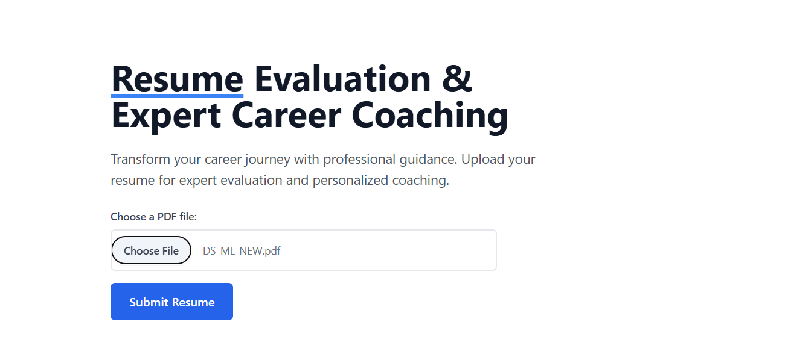
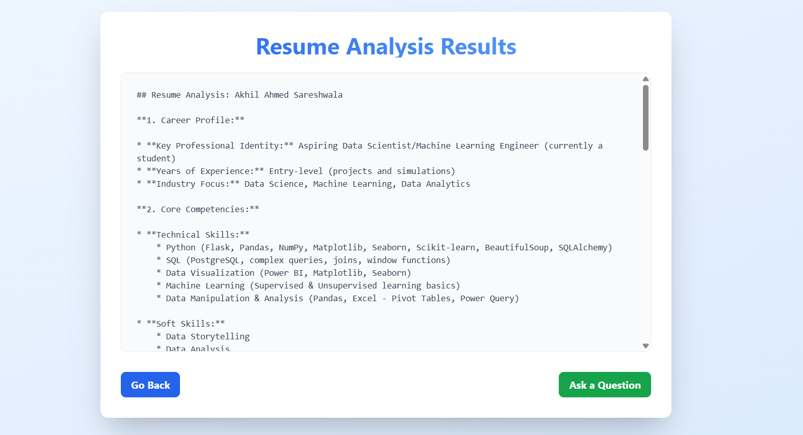
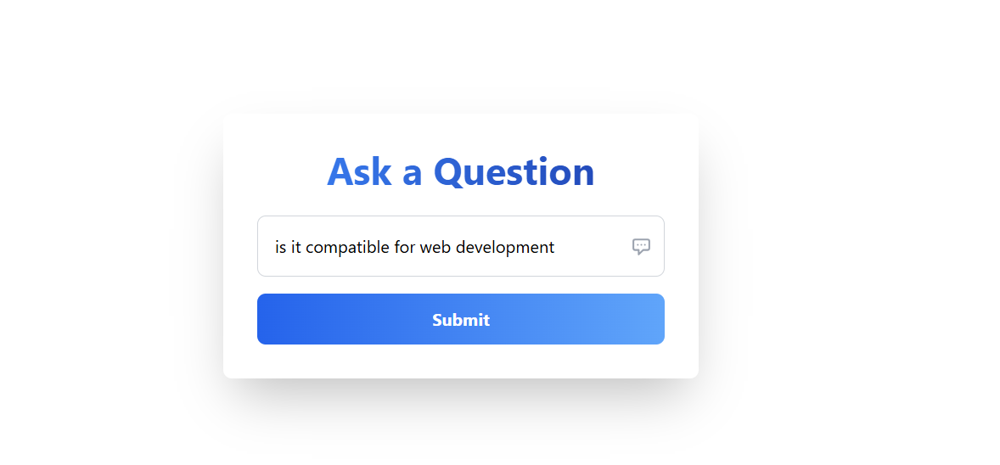
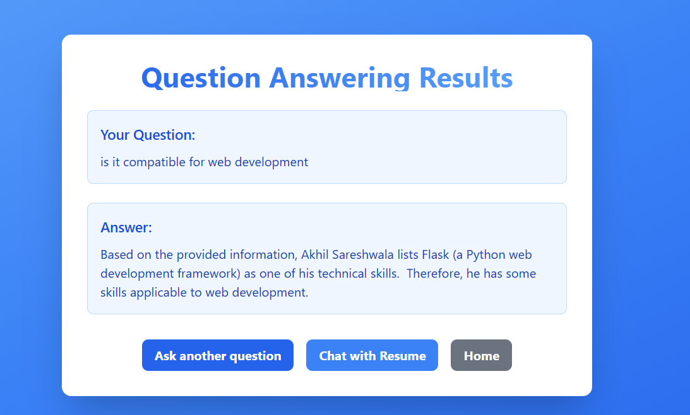
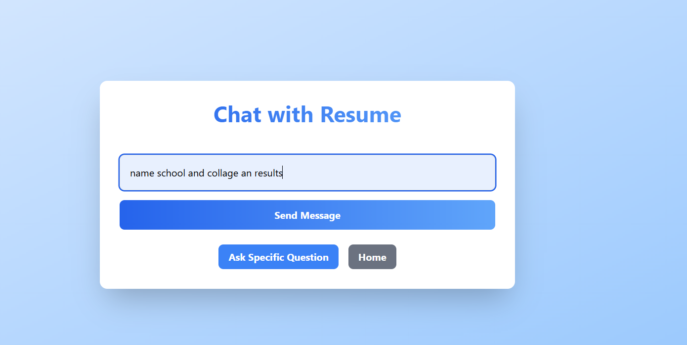
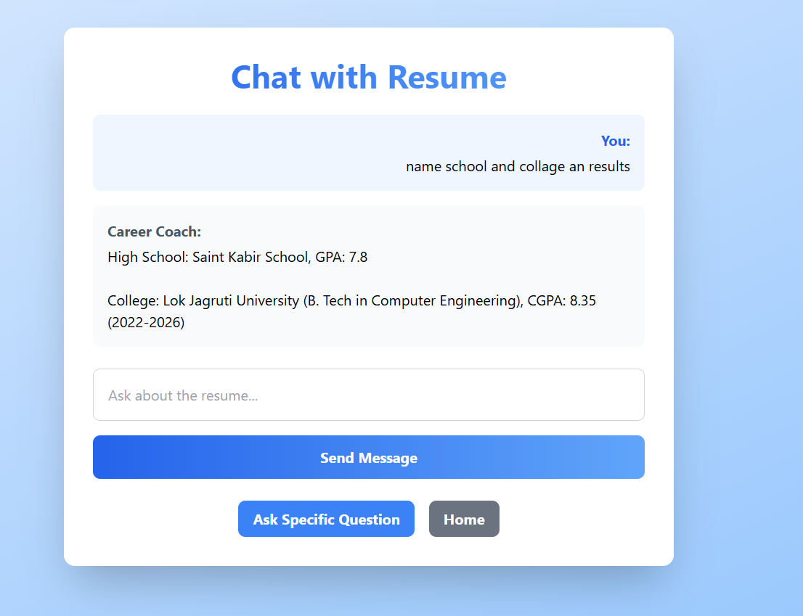

# AI Resume Analyzer & Career Coach

## Application Overview
This tool provides AI-powered resume analysis with three core functions:
1. **Resume Evaluation** - Automatic extraction of key qualifications
2. **Q&A System** - Instant answers about resume content
3. **Chat Interface** - Conversational career coaching

*Initial screen where users upload PDF resumes. Shows file selection and submission button.*

## Key Features Demonstrated

### 1. Comprehensive Resume Analysis

*Sample output showing:*
- Career profile summary
- Technical skills breakdown
- Soft skills assessment
- Structured bullet-point formatting

### 2. Targeted Question Answering

*Users can ask specific questions like "Is it compatible for web development?"*

*AI response analyzing web development compatibility based on Flask skills mentioned in the resume*

### 3. Interactive Chat Experience

*Conversational interface with:*
- Message history
- Free-form input field
- Navigation options

*Sample dialogue showing:*
- Education history retrieval
- GPA details
- Context-aware responses

## Technical Implementation

### Core Components
- **Flask** backend server
- **Google Gemini** for analysis
- **HuggingFace** embeddings
- **FAISS** vector storage
- **PyPDF2** text extraction

### Processing Flow
1. PDF upload → Text extraction
2. Chunking → Vector embedding
3. AI analysis → Structured output
4. Query handling → Contextual responses

## Usage Guide
1. Upload PDF resume
2. Review automatic analysis
3. Ask specific questions or chat interactively
4. Download/share results

## Support
For issues with:
- PDF processing → Ensure text-selectable files
- AI responses → Check API key configuration
- Performance → Reduce resume complexity

*All screenshots show actual UI components from the working application.*
